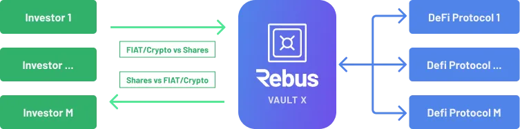

# Rebus Vault

The investment process implemented by Rebus foresees access to DeFi protocols via Vault.  
  
Generally speaking, the Vaults have some important qualities:

* They are safe deposits to store coins with a higher degree of security than crypto wallets
* Transactions are safer on the subscriber side because you can have direct verification and interaction with the Vault Owner.

Furthermore, in particular, **Rebus Vaults** bring the following benefits to the investor:

* They are a **layer between the investor and the DeFi investment products** that optimizes investment processes and management
* They can be managed collectively (group Vaults) where the individual investor receives a **Share** of the specific Vault in exchange for their money transfer
* They can effectively support the implementation of **systematic strategies** on the underlying DeFi products
* They can help in liquidity management

That said, in Rebus each investment strategy will be packaged in a Rebus Vault. This, depending on the case, will invest in one or more DeFi protocols and the management of the contributions conferred in the Vault will be passive or actively managed through systematic rules (Smart Beta).  
  
In the following figure an example of the structure of a generic Vault X.

The investor has access to the investment through the **Rebus Vault** with a process similar to the investment process used in Traditional Finance, in exchange for the transfer he receives a **Share of the specific Vault** that he can use to receive **Rewards or make Redeems**.